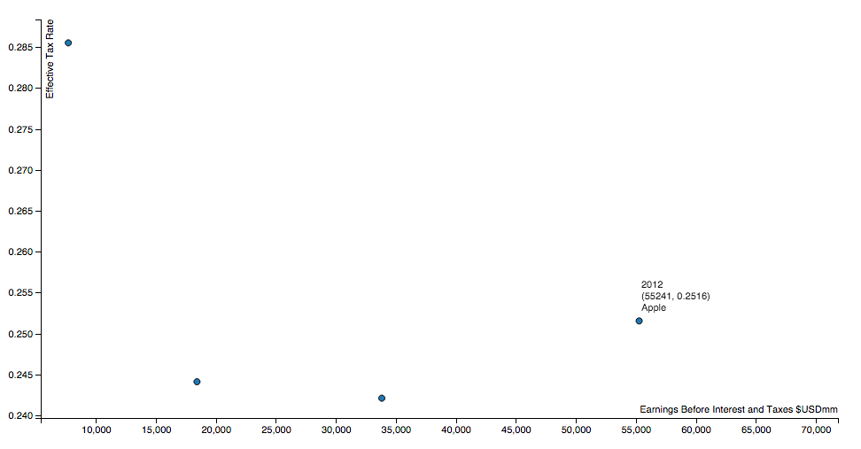

moebio-time-patterns
====================

an attempt to reproduce the time-patterns visualization by [@moebio](https://twitter.com/moebio)

see the visualization in action at 22:08 of this [talk](http://visualized.com/2014/presents/santiago-ortiz/).

the goal

progress so far - large plot

progress so far - small multiple plot

built using [R](http://www.r-project.org/) and [d3js](http://d3js.org/)
